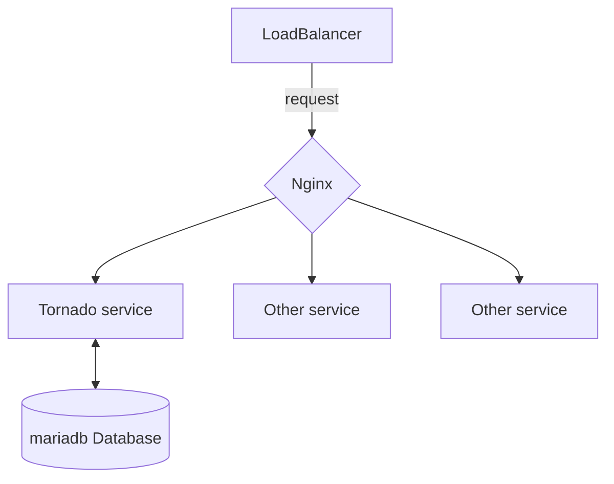

# minikube_example
`http://192.168.59.3:8888/` - tornado service  
`https://192.168.59.2/tornado_redirect` - tornado service with redirect
`http://192.168.59.2/tornado` - tornado service with redirect to http://192.168.59.3:8888/  
`http://192.168.59.2:80` - http version of nginx (redirects to https)  
`https://192.168.59.2:443`  - https version of nginx  


## Start
```bash
./setup.sh
```

## Requirements
* docker 
* [virtualbox](https://www.virtualbox.org/wiki/Downloads)
* [minikube](https://minikube.sigs.k8s.io/docs/start/)
* [kubectl](https://kubernetes.io/docs/tasks/tools/install-kubectl-macos/)
